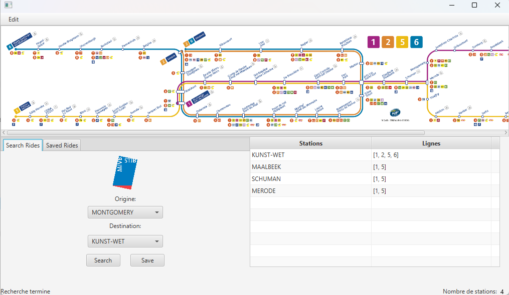

# Stib Ride
A JavaFX app to find the shortest metro route using Dijkstra’s algorithm.

## Table of Contents
- [About](#about)
- [Screenshot](#screenshot)
- [Features](#features)
- [Tech Stack](#tech-stack)
- [Getting Started](#getting-started)
  - [Prerequisites](#prerequisites)
  - [Installation](#installation)
- [Usage / Examples](#usage--examples)
  - [Search Rides](#search-rides)
  - [Saved Rides](#saved-rides)
  - [Edit Menu](#edit-menu)

## About
StibRide is a JavaFX application that calculates the shortest path between two metro stations using Dijkstra’s algorithm. The app provides a simple GUI to select origin and destination stations, visualize the path, and manage saved locations for quick access.

## Screenshot
<p align="center">
  
</p>
<p align="center">
    <em>Main GUI showing metro map, origin/destination selection, and saved rides</em>
</p>

## Features
- **Shortest Path Calculation**
  - Uses Dijkstra's algorithm to compute the optimal route between two stations. 
  - Displays the path on the GUI.

- **Station Management**
  - Save frequently used stations (e.g., Home, Work).
  - Rename, update, or delete saved stations.

- **Interactive GUI**
  - Select origin and destination via dropdown menus.
  - Switch between "Search Rides" and "Saved Rides" tabs.

- **Dataset Switching**
  - Toggle between FR/NL metro stations languages via the Edit button

## Tech Stack
<p align="center">
  
  
  
  
</p>

## Getting Started

### Prerequisites
Make sure you have the following installed on your system:

- **Java JDK 19** – required since the project is compiled with Java 19 [Download here](https://www.oracle.com/java/technologies/javase/jdk19-archive-downloads.html?utm_source=chatgpt.com)
- **Apache Maven** [Download here](https://maven.apache.org/download.cgi)
- **Git**

### Installation
- Clone the project: ```git clone https://github.com/souhaibelh/Stib-Ride.git```
- Open the project's root folder: ```cd Stib-Ride```
- Compile the project with maven: ```mvn compile```
- Run ```mvn javafx:run```

### Usage / Examples
- When you open the app, you will see **two tabs**:
    - **Search Rides**
    - **Saved Rides**

#### Search Rides
- Choose an **origin** and a **destination** station.
- Click **search** to calculate the shortest path (using Dijkstra's algorithm)
- The result is displayed in the **table on the right**, showing the stations and metro lines required (e.g., *Maelbeek → Line 1,5*).
- Click **Save** to store the rider under a custom name.

#### Saved Rides
- View all your saved rides.
- For each ride, you can:
    - **Recalculate** the shortest path (useful if you change destination or origin)
    - **Rename** the ride
    - **Change origin/destination** and save the changes
    - **Delete** the ride
- You can also **bulk edit** multiple rides at once.

#### Edit Menu
- On the **top-left corner**, click **Edit** and then click **Stations en neerlandais** to display the station names in Dutch
